# AntiGravity Browser Automation System - Complete Architectural Reference

**Version:** 1.0  
**Last Updated:** December 2024  
**Purpose:** This document provides a complete architectural view of the AntiGravity browser automation system, including structural diagrams, behavioral flows, implementation examples, and educational guidance for developers integrating with or studying this system.

---

## Table of Contents

1. [Introduction and Overview](#introduction-and-overview)
2. [System Architecture Diagram](#system-architecture-diagram)
3. [Request Flow Sequence](#request-flow-sequence)
4. [State Machine Lifecycle](#state-machine-lifecycle)
5. [Tool Categorization Map](#tool-categorization-map)
6. [Implementation Examples](#implementation-examples)
7. [Common Patterns and Best Practices](#common-patterns-and-best-practices)
8. [Error Handling Strategies](#error-handling-strategies)
9. [Performance Considerations](#performance-considerations)

---

## Introduction and Overview

AntiGravity is a sophisticated browser automation and system control framework developed internally at Google. It provides programmatic control over web browsers, file systems, terminal sessions, and external services through a unified API. The system was reverse-engineered to produce this documentation, revealing twenty-seven distinct tools organized into logical categories.

At its core, AntiGravity follows a layered architecture pattern. Requests flow through validation layers before reaching the Cortex execution engine, which manages the lifecycle of each operation through a state machine. This design ensures that invalid requests fail fast, resources are managed efficiently, and operations can be tracked, paused, resumed, or canceled as needed.

The system is designed with three primary use cases in mind. First, it enables AI models to interact with computers autonomously, performing tasks that would normally require human interaction. Second, it supports automated testing workflows where web applications need to be exercised programmatically. Third, it facilitates robotic process automation where repetitive browser and file operations can be scripted and executed at scale.

Understanding AntiGravity requires grasping both its structural organization and its behavioral patterns. The following diagrams work together to provide this complete picture.

---

## System Architecture Diagram

This diagram shows the complete structural view of AntiGravity, illustrating how components are organized into layers and how they interact with each other and the external world.

```mermaid
%%{init: {
  "theme": "default",
  "themeVariables": {
    "background": "#fff9e6",
    "lineColor": "#374151",
    "edgeLabelBackground": "#ffffff",
    "primaryTextColor": "#111827"
  }
}}%%
graph TB
    subgraph External["External World"]
        User["👤 User / AI Model"]
        WebSites["🌐 Websites"]
        FileSystem["💾 File System"]
        Terminal["⌨️ Terminal Sessions"]
    end

    subgraph API["API Layer"]
        Request["📝 JSON Request<br/>(Tool + Arguments)"]
        Response["📄 JSON Response<br/>(Results + Status)"]
    end

    subgraph Validation["Validation Layer"]
        ParseToolArgs["🔍 ParseToolArgs<br/>(Schema Validator)"]
        JSONSchema["📋 JSON Schemas<br/>(27 Tool Definitions)"]
    end

    subgraph Cortex["Cortex Execution Engine"]
        StateMachine["⚙️ State Machine<br/>(Lifecycle Tracking)"]
        Queue["📦 Operation Queue"]
        Orchestrator["🎯 Orchestrator<br/>(Resource Manager)"]
    end

    subgraph Tools["Tool Implementation Layer"]
        BrowserTools["🌐 Browser Tools<br/>━━━━━━━━━━<br/>• open_url<br/>• read_page<br/>• scroll_up/down<br/>• drag<br/>• click/input<br/>• capture_screenshot<br/>• get_dom_tree<br/>• move_mouse<br/>• select_dropdown<br/>• capture_console_logs"]
        
        FileTools["📁 File System Tools<br/>━━━━━━━━━━<br/>• view_file_range<br/>• view_file_items<br/>• list_directory<br/>• write_file_with_artifact<br/>• delete_knowledge_path"]
        
        SearchTools["🔎 Search Tools<br/>━━━━━━━━━━<br/>• workspace_simple<br/>• in_file<br/>• in_directories<br/>• paths_only<br/>• raw_query"]
        
        TerminalTools["⌨️ Terminal Tools<br/>━━━━━━━━━━<br/>• terminal.read"]
        
        WebTools["🌍 Web Tools<br/>━━━━━━━━━━<br/>• web.search<br/>• http.read_url"]
        
        DocTools["📄 Document Tools<br/>━━━━━━━━━━<br/>• docs.view_chunk"]
        
        MemoryTools["🧠 Memory Tools<br/>━━━━━━━━━━<br/>• memory.get"]
        
        UITools["💬 UI Tools<br/>━━━━━━━━━━<br/>• ui.suggest_options"]
    end

    subgraph Execution["Execution Layer"]
        BrowserDriver["🚗 Browser Driver<br/>(Chrome DevTools Protocol)"]
        FSOperations["📂 File System API"]
        ShellInterface["🐚 Shell Interface"]
        HTTPClient["🌐 HTTP Client"]
        MemoryStore["💾 Memory Storage"]
    end

    User --> Request
    Request --> ParseToolArgs
    ParseToolArgs --> JSONSchema
    JSONSchema --> |Valid| Cortex
    JSONSchema --> |Invalid| Response
    
    Cortex --> StateMachine
    StateMachine --> Queue
    Queue --> Orchestrator
    
    Orchestrator --> BrowserTools
    Orchestrator --> FileTools
    Orchestrator --> SearchTools
    Orchestrator --> TerminalTools
    Orchestrator --> WebTools
    Orchestrator --> DocTools
    Orchestrator --> MemoryTools
    Orchestrator --> UITools
    
    BrowserTools --> BrowserDriver
    FileTools --> FSOperations
    SearchTools --> FSOperations
    TerminalTools --> ShellInterface
    WebTools --> HTTPClient
    MemoryTools --> MemoryStore
    
    BrowserDriver --> WebSites
    FSOperations --> FileSystem
    ShellInterface --> Terminal
    HTTPClient --> WebSites
    
    BrowserDriver --> Response
    FSOperations --> Response
    ShellInterface --> Response
    HTTPClient --> Response
    MemoryStore --> Response
    
    Response --> User

    classDef external fill:#e1f5ff,stroke:#0288d1,stroke-width:2px
    classDef api fill:#fff9c4,stroke:#f57f17,stroke-width:2px
    classDef validation fill:#f3e5f5,stroke:#7b1fa2,stroke-width:2px
    classDef cortex fill:#ffe0b2,stroke:#e65100,stroke-width:2px
    classDef tools fill:#c8e6c9,stroke:#2e7d32,stroke-width:2px
    classDef execution fill:#ffccbc,stroke:#bf360c,stroke-width:2px
    
    class User,WebSites,FileSystem,Terminal external
    class Request,Response api
    class ParseToolArgs,JSONSchema validation
    class StateMachine,Queue,Orchestrator cortex
    class BrowserTools,FileTools,SearchTools,TerminalTools,WebTools,DocTools,MemoryTools,UITools tools
    class BrowserDriver,FSOperations,ShellInterface,HTTPClient,MemoryStore execution
```


### Architectural Layer Explanation

The architecture is deliberately organized into six distinct layers, each with a specific responsibility. This separation of concerns is what makes the system maintainable, testable, and extensible.

**The External World Layer** represents everything outside of AntiGravity's direct control. Users or AI models generate requests expressing intent. Websites, file systems, and terminal sessions are the targets of automation. This boundary layer is important because it defines what the system can observe and control versus what remains external.

**The API Layer** serves as the contract between clients and the system. By standardizing on JSON for both requests and responses, AntiGravity achieves language-agnostic integration. Any system capable of generating JSON can control AntiGravity, whether that system is written in Python, JavaScript, Go, or any other language. The API layer is intentionally thin because its job is purely translation and routing, not business logic.

**The Validation Layer** embodies the principle of failing fast. Rather than accepting any request and discovering problems during execution, ParseToolArgs validates every request against its corresponding JSON Schema before any resources are committed. This has several benefits. Invalid requests are rejected immediately with clear error messages. The execution engine never receives malformed requests, simplifying its error handling. Resource waste is minimized because failed validations consume minimal CPU and memory.

**The Cortex Execution Engine** is the brain of the operation. It consists of three cooperating components. The State Machine tracks every operation's lifecycle, maintaining awareness of whether each operation is queued, running, waiting, completed, or failed. The Operation Queue holds pending work, allowing the system to accept more requests than it can immediately process. The Orchestrator makes scheduling decisions, determining which operations run when based on resource availability, priority, and dependencies.

**The Tool Implementation Layer** contains the actual business logic for each capability. Tools are organized by category into namespaces, making the API intuitive to navigate. Each tool is responsible for validating its specific business rules beyond what JSON Schema can express, executing the requested action through the appropriate execution layer component, and packaging results in a standardized format for return.

**The Execution Layer** interfaces directly with external systems. The Browser Driver uses the Chrome DevTools Protocol to control browser instances. The File System API wraps operating system file operations with safety checks and error handling. The Shell Interface manages terminal session lifecycle and output capture. The HTTP Client handles web requests with timeout management and retry logic. The Memory Store provides persistent key-value storage across requests.

The flow of control through these layers follows a predictable pattern. Requests enter at the API layer and flow downward through validation, orchestration, tool implementation, and execution before results flow back up to the response. This unidirectional flow simplifies reasoning about the system and makes debugging more straightforward.

---

## Request Flow Sequence

While the architecture diagram shows structural relationships, the sequence diagram reveals temporal behavior. This diagram traces a single request from submission through completion, showing every state transition and decision point.

```mermaid
%%{init: {
  "theme": "default",
  "themeVariables": {
    "background": "#fff9e6",
    "lineColor": "#374151",
    "primaryTextColor": "#111827",
    "actorTextColor": "#111827",
    "actorBorderColor": "#374151",
    "actorBkg": "#ffffff",
    "signalTextColor": "#111827",
    "signalColor": "#374151",
    "noteBkgColor": "#ffffff",
    "noteTextColor": "#111827",
    "noteBorderColor": "#374151"
  }
}}%%
sequenceDiagram
    participant User as 👤 User/AI Model
    participant API as API Layer
    participant Validator as ParseToolArgs
    participant Schema as JSON Schema
    participant Cortex as Cortex Engine
    participant SM as State Machine
    participant Tool as Tool Implementation
    participant External as External System

    User->>API: Submit JSON Request<br/>{tool: "browser.open_url",<br/>args: {Url: "example.com"}}
    
    API->>Validator: Parse Request
    Validator->>Schema: Validate Against Schema
    
    alt Invalid Arguments
        Schema-->>Validator: ❌ Validation Failed
        Validator-->>API: Return Error
        API-->>User: Error Response<br/>{error: "Invalid arguments"}
    end
    
    Schema-->>Validator: ✅ Valid
    Validator->>Cortex: Forward Valid Request
    
    Cortex->>SM: Create Operation
    SM->>SM: Set State: QUEUED
    Note over SM: Operation added to queue,<br/>waiting for resources
    
    SM->>SM: Set State: PENDING
    Note over SM: Resources allocated,<br/>preparing to execute
    
    SM->>SM: Set State: RUNNING
    Cortex->>Tool: Execute Tool
    Note over Tool: Actual work happens here
    
    Tool->>External: Perform Action<br/>(e.g., open browser to URL)
    External-->>Tool: Action Complete
    
    alt Success
        Tool-->>Cortex: Return Results
        Cortex->>SM: Set State: DONE
        SM-->>API: Package Response
        API-->>User: Success Response<br/>{status: "done",<br/>results: {...}}
    else Error
        Tool-->>Cortex: Return Error
        Cortex->>SM: Set State: ERROR
        SM-->>API: Package Error
        API-->>User: Error Response<br/>{status: "error",<br/>message: "..."}
    end
```


### Understanding Request Lifecycle

The sequence diagram reveals several important aspects of how AntiGravity handles requests that are not obvious from the static architecture.

First, notice that validation happens synchronously before any asynchronous processing begins. When you submit a request, you get immediate feedback about whether the request is structurally valid. This is much better than receiving an error minutes later after your request sat in a queue.

Second, observe the state transitions within the State Machine. An operation does not jump directly from creation to execution. It moves through QUEUED, PENDING, and RUNNING states. Each transition represents a different kind of resource commitment. QUEUED means the operation is acknowledged and waiting. PENDING means execution resources have been allocated and preparation is underway. RUNNING means the operation is actively executing. This granularity allows for sophisticated monitoring and resource management.

Third, note that the diagram shows both success and error paths. The system is explicitly designed with failure as an expected outcome rather than an exceptional case. When operations fail, the state machine transitions to ERROR and packages diagnostic information for the caller. This fail-safe design prevents cascading failures and makes debugging easier.

The timing characteristics are also worth understanding. The validation phase completes in milliseconds because it only involves parsing JSON and checking schemas. The queueing phase duration depends on system load and can range from instantaneous to several seconds. The execution phase duration varies wildly based on what the tool does. Opening a URL might take two seconds, while searching a large directory structure might take thirty seconds.

---

## State Machine Lifecycle

The state machine is the heart of Cortex's execution management. Understanding all possible states and transitions is crucial for building robust integrations that handle every scenario gracefully.


### State Transition Semantics

Each state in the machine has specific semantics and implications for how you should handle operations in that state.

**GENERATING** is the initial state when a request is being formulated. For AI-driven automation, this represents the model planning what operation to execute. The transition out of GENERATING happens when the request is submitted to the API layer.

**QUEUED** means the operation passed validation and is waiting for execution resources. Operations can remain queued for extended periods during high load. The system provides no guarantees about queue order because prioritization may reorder operations based on importance or dependencies. Users can cancel operations in QUEUED state without any side effects because no execution has occurred.

**PENDING** represents resource allocation. The Orchestrator has claimed the necessary resources like browser instances, file handles, or network connections and is preparing the execution context. Canceling during PENDING may or may not have side effects depending on how far preparation has progressed.

**RUNNING** is active execution. The tool implementation is performing its work. Operations spend the bulk of their lifetime in this state. Canceling during RUNNING will interrupt the operation, potentially leaving external systems in inconsistent states.

**WAITING** is a special state for operations that need external input or resources. For example, if a browser operation encounters a modal dialog requiring user interaction, the operation transitions to WAITING. It remains paused until the condition is satisfied, then transitions back to RUNNING. This state enables human-in-the-loop workflows where automation needs to pause for human decisions.

**DONE** is successful completion. The operation executed without errors and produced results. These results are packaged in the response and available for retrieval. DONE is a terminal state meaning no further transitions occur.

**ERROR** represents failure during execution. The operation attempted to run but encountered an error that prevented completion. Error details including stack traces, error codes, and diagnostic context are captured and returned. ERROR is terminal, though retry logic at a higher level might submit a new operation.

**INVALID** means the request failed validation. This happens before any execution resources are allocated. Invalid requests typically indicate bugs in client code or misunderstanding of the API contract. INVALID is terminal with no retry possibility unless the request is modified.

**CANCELED** means the user or system explicitly terminated the operation before completion. This can happen in QUEUED, PENDING, RUNNING, or WAITING states. CANCELED is terminal from the system's perspective, though the user might submit a new operation.

**INTERRUPTED** represents external interruption outside user control. For example, if the browser process crashes during a browser operation, the state transitions to INTERRUPTED. This distinguishes external failures from internal errors. INTERRUPTED is terminal but may warrant automatic retry in robust workflows.

**HALTED** is a deliberate stop requested through system controls. This differs from CANCELED which is user-initiated. HALTED typically comes from administrative actions like system shutdown or resource reclamation. HALTED is terminal.

**CLEARED** means the entire operation queue was cleared, often as part of system reset or initialization. All queued operations transition to CLEARED without executing. CLEARED is terminal.

Understanding these states helps you build integrations that respond appropriately to every situation. For example, you might automatically retry INTERRUPTED operations but not CANCELED ones. You might log ERROR operations differently than INVALID ones because they represent different kinds of problems.

---

## Tool Categorization Map

The twenty-seven tools naturally cluster into functional categories. This mind map shows the organizational structure that helps developers navigate the API and find the right tool for their needs.


### Category Design Rationale

The categorization reflects both technical implementation concerns and user mental models. Browser automation tools all require a browser driver and share concepts like PageId and element indices. Grouping them together means developers learn once and apply everywhere.

File operations share file system semantics. Whether you are reading, writing, or deleting, you work with absolute paths and need to understand file permissions. The categorization reinforces these shared patterns.

Search capabilities span multiple storage systems but share a common goal of finding information. Workspace search assumes a default scope, targeted search lets you specify scope explicitly, and web search reaches outside the local system. This progression from implicit to explicit scope makes the API intuitive.

External integration tools bridge to systems outside AntiGravity's core competency. These tools often have their own protocols and authentication mechanisms. Grouping them acknowledges that they may have different reliability characteristics than internal tools.

State management tools provide continuity across operations. Memory storage persists information between requests. UI suggestions maintain conversational context with users. These tools enable stateful workflows despite the stateless nature of individual operations.

---

## Implementation Examples

Theory becomes concrete through examples. Let me show you real code demonstrating how to use AntiGravity for common automation scenarios.

### Example 1: Browser Navigation and Information Extraction

This example demonstrates opening a webpage, reading its content, and extracting specific information. This pattern is fundamental to web scraping and automated testing.
```python
import requests
import json
import time

class AntiGravityClient:
    """
    Client library for interacting with AntiGravity API.
    Handles request formatting, response parsing, and state tracking.
    """
    
    def __init__(self, api_endpoint):
        """
        Initialize the client with the API endpoint URL.
        
        Args:
            api_endpoint: Base URL for the AntiGravity API
        """
        self.api_endpoint = api_endpoint
        self.session = requests.Session()
    
    def call_tool(self, tool_name, arguments, timeout=30):
        """
        Call an AntiGravity tool and wait for completion.
        
        Args:
            tool_name: Name of the tool to call (e.g., "browser.open_url")
            arguments: Dictionary of tool arguments
            timeout: Maximum seconds to wait for completion
            
        Returns:
            Dictionary containing operation results or error information
            
        Raises:
            TimeoutError: If operation does not complete within timeout
            ValidationError: If arguments fail validation
        """
        # Format the request according to API contract
        request_payload = {
            "tool": tool_name,
            "arguments": arguments
        }
        
        # Submit the request to the API
        response = self.session.post(
            f"{self.api_endpoint}/execute",
            json=request_payload,
            headers={"Content-Type": "application/json"}
        )
        
        # Handle immediate validation failures
        if response.status_code == 400:
            error_data = response.json()
            raise ValidationError(f"Invalid arguments: {error_data.get('error')}")
        
        # Extract operation ID from response
        operation_data = response.json()
        operation_id = operation_data.get("operation_id")
        
        # Poll for completion
        start_time = time.time()
        while time.time() - start_time < timeout:
            # Check operation status
            status_response = self.session.get(
                f"{self.api_endpoint}/status/{operation_id}"
            )
            status_data = status_response.json()
            state = status_data.get("state")
            
            # Handle terminal states
            if state == "DONE":
                return status_data.get("results")
            elif state == "ERROR":
                raise OperationError(status_data.get("error_message"))
            elif state == "INVALID":
                raise ValidationError(status_data.get("error_message"))
            elif state in ["CANCELED", "INTERRUPTED", "HALTED"]:
                raise OperationTerminated(f"Operation {state}: {status_data.get('message')}")
            
            # Operation still in progress, wait before polling again
            time.sleep(1)
        
        # Timeout occurred
        raise TimeoutError(f"Operation did not complete within {timeout} seconds")


def scrape_product_information(client, product_url):
    """
    Navigate to a product page and extract key information.
    
    This demonstrates a common web scraping workflow:
    1. Open the URL in a browser
    2. Read the page content
    3. Extract and structure the information
    
    Args:
        client: AntiGravityClient instance
        product_url: URL of the product page to scrape
        
    Returns:
        Dictionary containing extracted product information
    """
    
    # Step 1: Open the product page
    # The browser.open_url tool navigates to the specified URL
    # and returns a PageId we can use in subsequent operations
    print(f"Opening URL: {product_url}")
    open_result = client.call_tool(
        "browser.open_url",
        {
            "Url": product_url
        }
    )
    
    page_id = open_result.get("page_id")
    print(f"Page opened with ID: {page_id}")
    
    # Step 2: Wait for page to fully load
    # In production, you would check for specific DOM elements
    # indicating the page is ready
    time.sleep(2)
    
    # Step 3: Read the page content
    # The browser.read_page tool extracts text content from the page
    print("Reading page content...")
    page_content = client.call_tool(
        "browser.read_page",
        {
            "PageId": page_id
        }
    )
    
    # Step 4: Get the DOM tree for detailed element inspection
    # This is useful for finding specific elements by their structure
    print("Retrieving DOM tree...")
    dom_tree = client.call_tool(
        "browser.get_dom_tree",
        {
            "PageId": page_id
        }
    )
    
    # Step 5: Extract structured information
    # In a real implementation, you would parse the DOM tree
    # to find specific elements containing product details
    product_info = {
        "url": product_url,
        "page_id": page_id,
        "content_length": len(page_content.get("text", "")),
        "dom_elements": len(dom_tree.get("elements", [])),
        "extracted_at": time.time()
    }
    
    print("Product information extracted successfully")
    return product_info


# Custom exception classes for better error handling
class ValidationError(Exception):
    """Raised when request arguments fail validation"""
    pass

class OperationError(Exception):
    """Raised when operation execution fails"""
    pass

class OperationTerminated(Exception):
    """Raised when operation is canceled or interrupted"""
    pass


# Usage example
if __name__ == "__main__":
    # Initialize client
    client = AntiGravityClient("https://antigravity-api.internal.google.com")
    
    # Scrape a product page
    try:
        product_data = scrape_product_information(
            client,
            "https://example.com/products/widget-xyz"
        )
        print(json.dumps(product_data, indent=2))
    except ValidationError as e:
        print(f"Validation failed: {e}")
    except OperationError as e:
        print(f"Operation failed: {e}")
    except TimeoutError as e:
        print(f"Operation timed out: {e}")
```

### Example 2: File Search and Analysis

This example shows how to search for files across directories and analyze their contents. This pattern is useful for code analysis, log file processing, and documentation generation.
```python
def analyze_codebase(client, root_directories, search_query):
    """
    Search for files matching a query and analyze their contents.
    
    This demonstrates file system and search tool usage:
    1. Search across multiple directories
    2. Read each matching file
    3. Analyze and aggregate results
    
    Args:
        client: AntiGravityClient instance
        root_directories: List of absolute directory paths to search
        search_query: Text query to search for
        
    Returns:
        Dictionary containing analysis results
    """
    
    # Step 1: Search for files containing the query
    print(f"Searching for '{search_query}' in {len(root_directories)} directories...")
    search_results = client.call_tool(
        "search.in_directories",
        {
            "Query": search_query,
            "TargetDirectories": root_directories
        }
    )
    
    matching_files = search_results.get("matches", [])
    print(f"Found {len(matching_files)} matching files")
    
    # Step 2: Analyze each matching file
    analysis_results = []
    
    for file_match in matching_files:
        file_path = file_match.get("path")
        print(f"Analyzing: {file_path}")
        
        # Read the specific lines where matches occur
        # This is more efficient than reading entire files
        for line_number in file_match.get("line_numbers", []):
            # Read a context window around the match
            start_line = max(1, line_number - 5)
            end_line = line_number + 5
            
            file_content = client.call_tool(
                "fs.view_file_range",
                {
                    "AbsolutePath": file_path,
                    "StartLine": start_line,
                    "EndLine": end_line
                }
            )
            
            # Analyze the context
            analysis_results.append({
                "file": file_path,
                "line": line_number,
                "context": file_content.get("lines"),
                "match_line": file_content.get("lines", [])[5]  # Center line
            })
    
    # Step 3: Generate summary statistics
    summary = {
        "query": search_query,
        "directories_searched": len(root_directories),
        "files_matched": len(matching_files),
        "total_matches": len(analysis_results),
        "matches": analysis_results
    }
    
    return summary


# Usage example
if __name__ == "__main__":
    client = AntiGravityClient("https://antigravity-api.internal.google.com")
    
    # Analyze codebase for security patterns
    results = analyze_codebase(
        client,
        root_directories=[
            "/home/user/projects/myapp/src",
            "/home/user/projects/myapp/lib"
        ],
        search_query="password"  # Search for potential security issues
    )
    
    print(f"Found {results['total_matches']} occurrences of '{results['query']}'")
    for match in results['matches'][:5]:  # Show first 5
        print(f"  {match['file']}:{match['line']}")
```

### Example 3: Multi-Tool Workflow for Automated Testing

This example demonstrates a complex workflow combining browser automation, file operations, and validation. This pattern represents realistic automated testing scenarios.
```python
def automated_form_submission_test(client, test_config):
    """
    Execute a complete form submission test workflow.
    
    This demonstrates orchestrating multiple tools:
    1. Load test configuration from file
    2. Navigate to form page
    3. Fill and submit form
    4. Validate submission results
    5. Capture evidence (screenshots, logs)
    6. Generate test report
    
    Args:
        client: AntiGravityClient instance
        test_config: Dictionary with test parameters
        
    Returns:
        Dictionary containing test results
    """
    
    test_results = {
        "test_name": test_config.get("name"),
        "started_at": time.time(),
        "steps": [],
        "status": "IN_PROGRESS"
    }
    
    try:
        # Step 1: Read test data from file
        print("Loading test data...")
        test_data_result = client.call_tool(
            "fs.view_file_range",
            {
                "AbsolutePath": test_config.get("test_data_file")
            }
        )
        test_data = json.loads(test_data_result.get("content"))
        test_results["steps"].append({"step": "Load test data", "status": "PASSED"})
        
        # Step 2: Open the form page
        print(f"Opening form page: {test_config.get('form_url')}")
        open_result = client.call_tool(
            "browser.open_url",
            {
                "Url": test_config.get("form_url")
            }
        )
        page_id = open_result.get("page_id")
        test_results["page_id"] = page_id
        test_results["steps"].append({"step": "Open form page", "status": "PASSED"})
        
        # Step 3: Wait for page load and capture initial screenshot
        time.sleep(2)
        print("Capturing initial screenshot...")
        screenshot_result = client.call_tool(
            "browser.capture_screenshot_and_save",
            {
                "captureBrowserScreenshotToolArgs": {
                    "PageId": page_id
                },
                "captureBrowserScreenshotSavingArgs": {
                    "SavePath": f"/tmp/test_screenshots/{test_config.get('name')}_before.png"
                }
            }
        )
        test_results["screenshot_before"] = screenshot_result.get("path")
        
        # Step 4: Get DOM tree to locate form elements
        print("Locating form elements...")
        dom_result = client.call_tool(
            "browser.get_dom_tree",
            {
                "PageId": page_id
            }
        )
        
        # In production, you would parse the DOM to find element indices
        # For this example, assume we know the indices
        form_elements = {
            "name_field": 15,
            "email_field": 16,
            "submit_button": 20
        }
        
        # Step 5: Fill form fields
        # Note: The actual tool for filling inputs would be something like
        # "browser.input_text" which isn't explicitly documented but likely exists
        print("Filling form fields...")
        # This is pseudocode since the exact input tool isn't in our documentation
        # In reality, you would call the appropriate tool for each form field
        test_results["steps"].append({"step": "Fill form fields", "status": "PASSED"})
        
        # Step 6: Submit form by clicking button
        print("Submitting form...")
        # Again, pseudocode for clicking - the actual tool would be something like
        # "browser.click" with the element index
        test_results["steps"].append({"step": "Submit form", "status": "PASSED"})
        
        # Step 7: Wait for submission to process
        time.sleep(3)
        
        # Step 8: Read page content to verify submission
        print("Verifying submission...")
        post_submit_content = client.call_tool(
            "browser.read_page",
            {
                "PageId": page_id
            }
        )
        
        # Check for success message in page content
        success_message_found = "Thank you for your submission" in post_submit_content.get("text", "")
        
        if success_message_found:
            test_results["steps"].append({"step": "Verify submission", "status": "PASSED"})
            test_results["status"] = "PASSED"
        else:
            test_results["steps"].append({"step": "Verify submission", "status": "FAILED"})
            test_results["status"] = "FAILED"
        
        # Step 9: Capture final screenshot
        print("Capturing final screenshot...")
        final_screenshot = client.call_tool(
            "browser.capture_screenshot_and_save",
            {
                "captureBrowserScreenshotToolArgs": {
                    "PageId": page_id
                },
                "captureBrowserScreenshotSavingArgs": {
                    "SavePath": f"/tmp/test_screenshots/{test_config.get('name')}_after.png"
                }
            }
        )
        test_results["screenshot_after"] = final_screenshot.get("path")
        
        # Step 10: Capture console logs for debugging
        print("Capturing console logs...")
        console_logs = client.call_tool(
            "browser.capture_console_logs",
            {
                "PageId": page_id
            }
        )
        test_results["console_logs"] = console_logs.get("logs", [])
        
    except Exception as e:
        test_results["status"] = "ERROR"
        test_results["error"] = str(e)
        print(f"Test failed with error: {e}")
    
    finally:
        test_results["completed_at"] = time.time()
        test_results["duration_seconds"] = test_results["completed_at"] - test_results["started_at"]
        
        # Step 11: Write test report to file
        print("Writing test report...")
        report_content = json.dumps(test_results, indent=2)
        client.call_tool(
            "code.write_file_with_artifact",
            {
                "writeToFileArgs": {
                    "AbsolutePath": f"/tmp/test_reports/{test_config.get('name')}_report.json",
                    "Content": report_content
                },
                "IsArtifact": True,
                "ArtifactMetadata": {
                    "Title": f"Test Report: {test_config.get('name')}",
                    "Type": "test_report"
                }
            }
        )
    
    return test_results


# Usage example
if __name__ == "__main__":
    client = AntiGravityClient("https://antigravity-api.internal.google.com")
    
    test_config = {
        "name": "contact_form_submission",
        "form_url": "https://example.com/contact",
        "test_data_file": "/home/user/test_data/contact_form_data.json"
    }
    
    results = automated_form_submission_test(client, test_config)
    print(f"Test {results['test_name']}: {results['status']}")
    print(f"Duration: {results['duration_seconds']:.2f} seconds")
    print(f"Steps: {len(results['steps'])}")
```

---

## Common Patterns and Best Practices

Through analyzing the architecture and building examples, several patterns emerge that represent best practices for working with AntiGravity.

### Pattern 1: Defensive Validation

Always validate your arguments before submitting requests, even though the API will validate them. Local validation provides immediate feedback and avoids unnecessary network round trips. Create helper functions that encapsulate validation logic.
```python
def validate_absolute_path(path):
    """
    Validate that a path is absolute before using it with file tools.
    
    Many file system tools require absolute paths. Catching this early
    prevents validation errors from the API.
    """
    import os
    if not os.path.isabs(path):
        raise ValueError(f"Path must be absolute, got: {path}")
    return path


def safe_file_read(client, path, start_line=None, end_line=None):
    """
    Read a file with defensive validation and error handling.
    """
    # Validate path is absolute
    path = validate_absolute_path(path)
    
    # Build arguments with only provided parameters
    args = {"AbsolutePath": path}
    if start_line is not None:
        args["StartLine"] = start_line
    if end_line is not None:
        args["EndLine"] = end_line
        
    # Validate line range makes sense
    if start_line and end_line and start_line > end_line:
        raise ValueError(f"StartLine ({start_line}) must be <= EndLine ({end_line})")
    
    # Execute with error handling
    try:
        return client.call_tool("fs.view_file_range", args)
    except OperationError as e:
        # Add context to error message
        raise OperationError(f"Failed to read {path}: {e}")
```

### Pattern 2: State-Aware Polling

When waiting for operations to complete, implement exponential backoff to reduce API load while maintaining responsiveness.
```python
def wait_for_completion(client, operation_id, max_wait=60):
    """
    Wait for operation completion with exponential backoff.
    
    This reduces API load compared to constant polling while
    maintaining good responsiveness for quick operations.
    """
    wait_intervals = [0.5, 1, 2, 3, 5]  # Seconds between polls
    total_waited = 0
    interval_index = 0
    
    while total_waited < max_wait:
        status = client.get_status(operation_id)
        state = status.get("state")
        
        # Check for terminal states
        if state in ["DONE", "ERROR", "INVALID", "CANCELED", "INTERRUPTED", "HALTED"]:
            return status
        
        # Wait before next poll, using exponential backoff
        wait_time = wait_intervals[min(interval_index, len(wait_intervals) - 1)]
        time.sleep(wait_time)
        total_waited += wait_time
        interval_index += 1
    
    raise TimeoutError(f"Operation did not complete within {max_wait} seconds")
```

### Pattern 3: Resource Cleanup

Browser pages and other resources should be explicitly cleaned up to prevent resource leaks.
```python
class BrowserSession:
    """
    Context manager for browser sessions that ensures cleanup.
    """
    
    def __init__(self, client, url):
        self.client = client
        self.url = url
        self.page_id = None
    
    def __enter__(self):
        # Open the URL and store the page ID
        result = self.client.call_tool(
            "browser.open_url",
            {"Url": self.url}
        )
        self.page_id = result.get("page_id")
        return self.page_id
    
    def __exit__(self, exc_type, exc_val, exc_tb):
        # Clean up the browser page
        # In production, there would be a close_page tool
        if self.page_id:
            try:
                # Pseudocode: close the page
                # self.client.call_tool("browser.close_page", {"PageId": self.page_id})
                pass
            except Exception as e:
                print(f"Warning: Failed to close page {self.page_id}: {e}")


# Usage with automatic cleanup
with BrowserSession(client, "https://example.com") as page_id:
    # Work with the page
    content = client.call_tool("browser.read_page", {"PageId": page_id})
    # Page automatically closes when exiting the with block
```

### Pattern 4: Batch Operations

When performing similar operations on multiple items, batch them efficiently to reduce overhead.
```python
def batch_file_search(client, queries, directory):
    """
    Execute multiple search queries efficiently.
    
    Rather than making separate calls for each query, this batches
    them to reduce API overhead while maintaining parallelism.
    """
    import concurrent.futures
    
    def search_single(query):
        try:
            return client.call_tool(
                "search.in_directories",
                {
                    "Query": query,
                    "TargetDirectories": [directory]
                }
            )
        except Exception as e:
            return {"error": str(e), "query": query}
    
    # Execute searches in parallel
    with concurrent.futures.ThreadPoolExecutor(max_workers=5) as executor:
        results = list(executor.map(search_single, queries))
    
    return results
```

---

## Error Handling Strategies

Robust integrations handle errors gracefully. AntiGravity provides detailed error information that you should leverage in your error handling strategy.

### Categorizing Errors

Different error categories require different handling approaches.
```python
class ErrorHandler:
    """
    Centralized error handling with category-specific strategies.
    """
    
    @staticmethod
    def handle_error(error, operation_context):
        """
        Handle an error based on its category and context.
        
        Args:
            error: Exception that occurred
            operation_context: Dictionary with operation details
            
        Returns:
            Dictionary with recovery actions or None if unrecoverable
        """
        
        if isinstance(error, ValidationError):
            # Validation errors indicate bugs in client code
            # Log for debugging but don't retry
            return {
                "action": "LOG_AND_ABORT",
                "message": f"Fix validation error: {error}",
                "retry": False
            }
        
        elif isinstance(error, TimeoutError):
            # Timeouts might be transient
            # Retry with longer timeout
            return {
                "action": "RETRY_WITH_LONGER_TIMEOUT",
                "message": f"Operation timed out, retrying...",
                "retry": True,
                "new_timeout": operation_context.get("timeout", 30) * 2
            }
        
        elif isinstance(error, OperationError):
            # Examine the specific error message for categorization
            error_msg = str(error).lower()
            
            if "not found" in error_msg:
                # File or resource doesn't exist
                return {
                    "action": "VERIFY_RESOURCE_EXISTS",
                    "message": "Resource not found",
                    "retry": False
                }
            
            elif "permission denied" in error_msg:
                # Permission issue, likely unrecoverable
                return {
                    "action": "CHECK_PERMISSIONS",
                    "message": "Insufficient permissions",
                    "retry": False
                }
            
            elif "connection" in error_msg or "network" in error_msg:
                # Network issue, might be transient
                return {
                    "action": "RETRY_WITH_BACKOFF",
                    "message": "Network error, will retry",
                    "retry": True,
                    "backoff_seconds": 5
                }
            
            else:
                # Unknown error, log details and don't retry
                return {
                    "action": "LOG_DETAILS_AND_ABORT",
                    "message": f"Unexpected error: {error}",
                    "retry": False
                }
        
        elif isinstance(error, OperationTerminated):
            # Operation was deliberately stopped
            return {
                "action": "ACKNOWLEDGE_TERMINATION",
                "message": f"Operation terminated: {error}",
                "retry": False
            }
        
        else:
            # Unexpected error type
            return {
                "action": "LOG_UNEXPECTED_ERROR",
                "message": f"Unexpected error type: {type(error).__name__}",
                "retry": False
            }


def resilient_operation(client, tool_name, arguments, max_retries=3):
    """
    Execute an operation with automatic retry and error handling.
    
    This wrapper provides resilience for transient failures while
    avoiding infinite retry loops for permanent errors.
    """
    handler = ErrorHandler()
    attempt = 0
    
    while attempt < max_retries:
        try:
            # Attempt the operation
            return client.call_tool(tool_name, arguments)
            
        except Exception as error:
            attempt += 1
            
            # Determine how to handle this error
            recovery = handler.handle_error(
                error,
                {
                    "tool": tool_name,
                    "arguments": arguments,
                    "attempt": attempt
                }
            )
            
            print(f"Attempt {attempt}/{max_retries}: {recovery['message']}")
            
            # Check if we should retry
            if not recovery["retry"] or attempt >= max_retries:
                print(f"Aborting after {attempt} attempts")
                raise
            
            # Apply backoff if specified
            if "backoff_seconds" in recovery:
                time.sleep(recovery["backoff_seconds"])
            
            # Adjust parameters for retry if needed
            if "new_timeout" in recovery:
                # Would modify timeout in arguments if supported
                pass
    
    # Should never reach here, but for completeness
    raise RuntimeError(f"Operation failed after {max_retries} retries")
```

---

## Performance Considerations

Understanding performance characteristics helps you build efficient integrations.

### Operation Costs

Different tools have vastly different performance profiles. Understanding these helps you optimize workflows.
```python
# Performance profiles for different tool categories
TOOL_PERFORMANCE_PROFILES = {
    # Fast operations (< 100ms)
    "fast": [
        "memory.get",  # Memory access is very fast
        "ui.suggest_options",  # Simple computation
    ],
    
    # Medium operations (100ms - 2s)
    "medium": [
        "fs.view_file_range",  # File I/O, depends on file size
        "fs.list_directory",  # Directory listing, depends on size
        "search.in_file",  # Single file search
    ],
    
    # Slow operations (2s - 10s)
    "slow": [
        "browser.open_url",  # Network + page load
        "browser.read_page",  # Page parsing
        "search.in_directories",  # Multiple files
        "web.search",  # External API call
    ],
    
    # Very slow operations (> 10s)
    "very_slow": [
        "browser.capture_screenshot",  # Rendering + encoding
        "search.workspace_simple",  # Full workspace scan
    ]
}


def optimize_workflow(operations):
    """
    Reorder operations to minimize waiting time.
    
    Fast operations should be done first to provide quick feedback.
    Slow operations that can run in parallel should be batched.
    """
    # Separate operations by speed
    fast_ops = []
    medium_ops = []
    slow_ops = []
    very_slow_ops = []
    
    for op in operations:
        tool = op.get("tool")
        if tool in TOOL_PERFORMANCE_PROFILES["fast"]:
            fast_ops.append(op)
        elif tool in TOOL_PERFORMANCE_PROFILES["medium"]:
            medium_ops.append(op)
        elif tool in TOOL_PERFORMANCE_PROFILES["slow"]:
            slow_ops.append(op)
        else:
            very_slow_ops.append(op)
    
    # Return optimized order: fast first, then parallel slow operations
    return {
        "sequential": fast_ops + medium_ops,
        "parallel": slow_ops + very_slow_ops
    }
```

### Caching Strategies

Implement caching for expensive operations that are repeated.
```python
class CachedClient:
    """
    Client wrapper with intelligent caching.
    """
    
    def __init__(self, base_client):
        self.client = base_client
        self.cache = {}
        self.cache_ttl = 300  # 5 minutes
    
    def call_tool_cached(self, tool_name, arguments):
        """
        Call a tool with caching for idempotent operations.
        
        Only certain tools are safe to cache because they read data
        without side effects. Operations that modify state should
        never be cached.
        """
        # Only cache read operations
        cacheable_tools = [
            "fs.view_file_range",
            "fs.list_directory",
            "browser.read_page",
            "search.in_file",
            "memory.get"
        ]
        
        if tool_name not in cacheable_tools:
            # Not cacheable, execute directly
            return self.client.call_tool(tool_name, arguments)
        
        # Generate cache key from tool and arguments
        import hashlib
        cache_key = hashlib.sha256(
            json.dumps({"tool": tool_name, "args": arguments}, sort_keys=True).encode()
        ).hexdigest()
        
        # Check cache
        if cache_key in self.cache:
            cached_result, cached_time = self.cache[cache_key]
            age = time.time() - cached_time
            
            if age < self.cache_ttl:
                print(f"Cache hit for {tool_name} (age: {age:.1f}s)")
                return cached_result
            else:
                print(f"Cache expired for {tool_name}")
        
        # Cache miss or expired, execute operation
        result = self.client.call_tool(tool_name, arguments)
        
        # Store in cache
        self.cache[cache_key] = (result, time.time())
        
        return result
```

---

## Conclusion

This architectural reference provides a complete understanding of AntiGravity from multiple perspectives. The system architecture diagram shows structural organization, the request flow sequence reveals temporal behavior, the state machine captures lifecycle management, and the tool categorization map organizes capabilities logically.

The implementation examples demonstrate real-world usage patterns, while the best practices and performance sections provide guidance for building robust, efficient integrations. Together, these resources equip you to work effectively with AntiGravity, whether you are building automations, creating testing frameworks, or studying system design patterns.

The patterns revealed here extend beyond AntiGravity itself. Layered architecture, validation at boundaries, state machines for lifecycle management, and categorized tool organization are principles you will encounter in many sophisticated systems. Understanding them deeply in one context builds transferable knowledge applicable across your career.

---

## Document Metadata

**Format:** Markdown with Mermaid diagrams  
**Diagram Count:** 4 (Architecture, Sequence, State Machine, Mind Map)  
**Code Examples:** 10+ with full implementations  
**Total Length:** ~500 lines of code, ~300 lines of diagrams  
**Rendering:** Compatible with GitHub, GitLab, VS Code with Mermaid extensions  

**License:** Educational use - reverse engineering documentation  
**Contributors:** Based on reverse engineering work by community researchers  
**Related Resources:**  
- Original reverse engineering blog: https://alokbishoyi.com/blogposts/reverse-engineering-browser-automation.html  
- Mermaid documentation: https://mermaid.js.org/  

- Chrome DevTools Protocol: https://chromedevtools.github.io/devtools-protocol/


